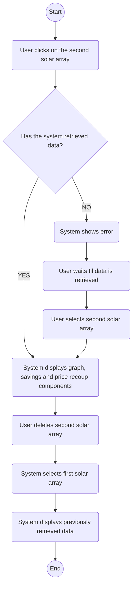

# Activity Diagrams 

### Creating a solar array 

**Name**: Create a solar array
**Pre - conditions**: User has not created a solar array before
**Post - conditions**: User has created the solar array, it is saved in the homescreen and they are able to edit it.

**Main flow**:
1. User opens the app
2. The system shows the homescreen 
3. User clicks on the pluss button 
4. The app shows a map and a dropdown menu
5. The user searches for an address 
6. The system navigates to that address in the graph
7. The system displays the available roof sections
8. The user clicks on their desired number of roof sections
9. The user drags up the drop - down menu
10. The user clicks on a roof section 
11. The user chooses not to edit the roof section 
12. The user selects a solar panel type 
13. The system shows a price overview
14. The user presses the save button
15. The user provides a name for the solar array
16. The user provides their electricity usage
17. The user saves the solar array
18. The system navigates back to the home screen. 

**Alternative flow**:
4.1 The user navigates to their address on the map
4.2 The user clicks on a house
4.3 The system returns to step 7

8.1 The user provides the required roof measurements (area, direction, angle and panels)
8.2 The user adds the roof section
8.3 The system returns to step 9

10.1 The user chooses what to edit 
10.2 The user edits the chosen element 
10.3 The user saves their edited roof section
10.4 The system returns to step 12

```mermaid
flowchart TD;

    Start((Start))

    HomeScreen(Shows homescreen)
    PlusButton(Create new solar array)
    MapAndDropdown(Shows a map and a drop-down menu)
    Search{Search address or navigate on map?}

    ClickAddress(Select a house on the map)
    ShowRoofSections(Show available roof sections)
    ChooseRoofSections(Add desired roof sections)
    AddRoofManually{Add from map or add manuallly?}

    AddArea(Write area)
    AddDirection(Write direction)
    AddAngle(Write angle)
    AddPanels(Write number of panels)


    ClickRoofSection(Click on chosen roof section)
    EditRoofSection{Edit roof section?}
    ChooseEditSegment{Choose editing segment}

    Edit(Edit)
    SaveChanges(Save)

    SelectSolarPanel{Select a solar panel type}
    ShowPriceOverview(Show price overview)

    SelectSaveButton(Press save button)
    WriteName(Write solar array name)
    WriteElectricity(Write electricity usage)
    Save(Save)

    SavedHomeScreen(Shows homescreen with saved solar array)

    Start --> HomeScreen
    HomeScreen --> PlusButton
    PlusButton --> MapAndDropdown
    MapAndDropdown --> Search 

    Search --Navigate on map--> ClickAddress --> ShowRoofSections 
    Search --Search on searchfield --> ShowRoofSections

    ShowRoofSections --> ChooseRoofSections 
    ChooseRoofSections --> AddRoofManually
    
    AddRoofManually --From map--> ClickRoofSection
    AddRoofManually --Manually-->AddArea
    
    AddArea --> AddDirection
    AddDirection --> AddAngle
    AddAngle --> AddPanels
    AddPanels --> ClickRoofSection
    
    ClickRoofSection --> EditRoofSection
    EditRoofSection --YES--> ChooseEditSegment
    EditRoofSection --NO--> SelectSolarPanel

    ChooseEditSegment --Area--> Edit
    ChooseEditSegment --Direction-->  Edit
    ChooseEditSegment --Angle-->  Edit
    ChooseEditSegment --Panels-->  Edit

    Edit --> SaveChanges
    SaveChanges --> SelectSolarPanel
    SelectSolarPanel --PREMIUM--> ShowPriceOverview
    SelectSolarPanel --ECONOMY--> ShowPriceOverview
    SelectSolarPanel --PERFORMANCE--> ShowPriceOverview


    ShowPriceOverview --> SelectSaveButton
    SelectSaveButton --> WriteName
    WriteName --> WriteElectricity
    WriteElectricity --> Save
    Save --> SavedHomeScreen

    End((End))

    SavedHomeScreen --> End

```

### Navigating between solar arrays and deleting deleting them

**Name**: Navigating between solar arrays and deleting them
**Pre - conditions**: User opens the app to the homescreen with two existing solar arrays 
**Post - conditions**: User has successfully navigated between the solar arrays and deleted one.

**Main flow**:
1. User clicks on the second solar array 
2. System retrieves data for the second solar array
3. System displays the graph, savings and price recoup components for second solar array 
4. User deletes the first solar array
5. System navigates user back to the first solar array
6. System displays the previously retrieved data 

**Alternative flow**:
1.1 System has not yet retrieved data for the first solar array
1.2 System shows an error and prevents user from navigating to the second solar array.
1.3 User waits for data be retrieved
1.4 System retrieves data
1.5 User clicks on second solar array
1.6 System returns to step 2

